# Data Exploration in R
## Time Series Analysis and Predictions
The dataset was collected through a sportwatch and contains several metrics (distance, duration, speed, power, elevation, heart rate....) for different types of activities (cycling, swimming, virtual rides, running,...). 
## Reading and Preparing the data

First, we read the data from a .csv file and adjust the columns’ units
using ***mutate***. The first activity I’ve chosen to make the time
analysis was <u>virtual ride</u>, but there is not enough historical
data to predict one year ahead. The activity starts only in 2020, what
can compromise the future predictions.

``` r
require(tidyverse)
require(lubridate)
```

``` r
dat <- read.csv("Activities_2022.csv",header = T)

dat <- dat %>% 
  mutate(start_time=as_datetime(startTimeLocal/1000), # create a timestamp
         date = floor_date(start_time,"month"), # round to the day
         distance=distance/1E5, # convert in km
         calories = calories/4.184) %>% # convert from joules in calories
  mutate(across(contains("elevation"),function(xx) xx/1E2))  %>%  # convert to meters
  mutate(across(contains("Speed"),function(xx) xx*36))  %>% # convert to km/h
  mutate(across(c(duration,contains("Duration")),
                function(xx) time_length(xx/1000,"minutes"))) %>% # convert to minutes
  
  mutate(is_virtualride=ifelse(activityType == "virtual_ride",T,F))
         # selecting the Activity type 
dat_clean <- filter(dat,!(activityId %in% c(407226313,2321338)) & year(date)>=2012) %>% 
  filter(avgSpeed<60 & avgSpeed>1) %>% 
  filter(distance>0) %>% 
  filter(duration>0)  # removing some outliers
```

So, lets try <u>cycling</u> and check the data.

``` r
dat_clean <- mutate(dat_clean,is_cycling=ifelse(activityType == "cycling",T,F))
dat_cycling <- filter(dat_clean,is_cycling) %>% # Only cycling 
  select(date,avgSpeed,distance,duration,avgHr,avgPower,elevationGain,
         max20MinPower,calories,normPower,maxBikeCadence,avgBikeCadence)
dat_cycling <- dat_cycling %>%
  select(date, duration, avgSpeed, distance, avgHr, elevationGain)
head(dat_cycling)
```

    ##         date duration avgSpeed  distance avgHr elevationGain
    ## 1 2021-10-01 182.6489  32.5800  99.17674   136           415
    ## 2 2021-10-01 157.4970  32.1804  84.46938    NA           441
    ## 3 2021-10-01 181.2328  30.3156  91.57424   141          1171
    ## 4 2021-10-01 135.5403  31.3200  70.74952   141           714
    ## 5 2021-09-01 172.4566  29.2428  84.05264   148          1348
    ## 6 2021-09-01 232.9507  30.5496 118.61590   146          1528

It looks like we have consistent data since 2012. It is important to say
that we want monthly predictions for our series. So it is necessary to
aggregate the daily observations into months. One way of doing that is
using the ***apply.monthly*** function from the **xts** library.

Let’s see that working with the average speed: **avgSpeed**. First we
remove the rows with NAs and then we complete the series with the months
without metrics. The command ***complete*** completes the missing months
with **NAs**.

``` r
library(xts)
```

``` r
dat_cycling_avgSpeed <- dat_cycling %>%
  select(date,avgSpeed) %>%
  na.omit() %>% 
  complete(date = seq.Date(min(as.Date(date)), max(as.Date(date)), by="month"))

xts2 <- xts(dat_cycling_avgSpeed$avgSpeed, dat_cycling_avgSpeed$date)
series <- apply.monthly(xts2,mean)
head(series)
```

    ##                [,1]
    ## 2012-01-01 28.47246
    ## 2012-02-01 26.01982
    ## 2012-03-01 30.33720
    ## 2012-04-01 28.78114
    ## 2012-05-01 29.29468
    ## 2012-06-01 25.61983

``` r
#plot(dat_cycling$date,dat_cycling$avgSpeed,ylab='avgSpeed', xlab='time')
ggplot(dat_cycling_avgSpeed, aes(date,avgSpeed)) + geom_point(size=1, color = "steelblue")
```

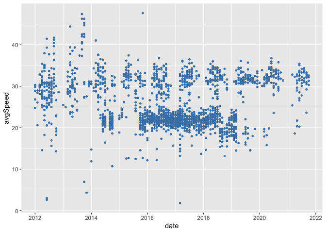

The frequency distribution for our data is skewed. The cycling
activities do not seem to have the same goal. There are very long
cycling activities and with very high average speeds. After 2014, there
is more consistency with the two types of activities we have in this
graph. Maybe it would be a good idea to separate those activities in
“High/Lower avgSpeed Cycling”. But let’s start our analysis with the
mean value of the entire data above.

Before we start the time series analysis, we have the choice of imputing
the missing values. The Kalman filters are a good option on imputing
values in time series. So, we use the library ***imputeTS*** and the
function ***na_kalman*** for this task. The plots below show the missing
values and new values that were inserted in the series.

``` r
library(imputeTS)
```

``` r
series_imp <- na_kalman(series)
head(series_imp)
```

    ## Warning: timezone of object (UTC) is different than current timezone ().

    ##                [,1]
    ## 2012-01-01 28.47246
    ## 2012-02-01 26.01982
    ## 2012-03-01 30.33720
    ## 2012-04-01 28.78114
    ## 2012-05-01 29.29468
    ## 2012-06-01 25.61983

``` r
ggplot_na_distribution(series)
```

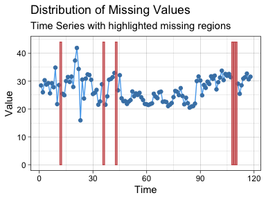

``` r
ggplot_na_imputations(series, series_imp)
```


**Stationarity** means that the time series does not have a trend, has a
constant variance, a constant autocorrelation pattern, and no seasonal
pattern.

From the plot above, we can already see that the variance is not
constant, as well as the mean value. therefore, it looks like a
non-stationary process.

## AC and PAC Functions:

From the Autocorrelation plot, we can observe a strong correlation at
the first couple of lags. The function drops slowly, which is a
characteristic of **non-stationary** processes.

We can see the presence of **seasonal patterns** (although not very
clear), because the auto-correlations are larger for lags at multiples
of the seasonal frequency than for other lags.

``` r
library(forecast)
```

``` r
par(mfrow=c(3,1))
Acf(series_imp)
Pacf(series_imp)
Acf(diff(series_imp))
```

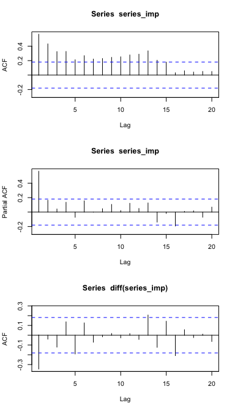

## Stationarity Tests

We chose two stationarity tests to be performed.

**Ljung-Box Test:**

Here the null hypothesis is that there is no autocorrelation between the
different lags. A significant p-value (\<0.05) in this test **rejects
the** null hypothesis that the time series isn’t autocorrelated.
Therefore, in the case of our series, the test shows
**non-stationarity.**

``` r
Box.test(series_imp, lag=10, type="Ljung-Box")
```

    ## 
    ##  Box-Ljung test
    ## 
    ## data:  series_imp
    ## X-squared = 131.53, df = 10, p-value < 2.2e-16

**KPSS Unit Root Test:**

We use the *Kwiatkowski-Phillips-Schmidt-Shin (KPSS) test*, where the
null hypothesis is that the data are stationary. Small p-values (e.g.,
less than 0.1) suggest that the series is not stationary and
differencing is required. And, in fact, our series is, according to the
test, not stationary. However, the differencing (diff) of our series
shows a KPSS test with a p-value>0.1, what we would expect for
stationary data.

``` r
library(tseries)
```

``` r
kpss.test(series_imp)
```

    ## 
    ##  KPSS Test for Level Stationarity
    ## 
    ## data:  series_imp
    ## KPSS Level = 0.37098, Truncation lag parameter = 4, p-value = 0.08966

``` r
kpss.test(diff(series_imp))
```

    ## Warning in kpss.test(diff(series_imp)): p-value greater than printed p-value

    ## 
    ##  KPSS Test for Level Stationarity
    ## 
    ## data:  diff(series_imp)
    ## KPSS Level = 0.040858, Truncation lag parameter = 4, p-value = 0.1

## Predictions using AUTO.ARIMA:

Returns best ***ARIMA*** model according to either AIC, AICc or BIC
value.

For ARIMA to perform at its best it needs the data to be stationary.
That means that the mean and variance are constant over the entire set.
Differencing is used to transform the data so that it is stationary. So,
we expect d =1 in Arima(p,d,q). To minimize variations in the variance,
the transformation of BoxCox can be used.

We expect also a SARIMA (with seasonal parameters p,d,q) because of the
presence of not very clear **seasonal patterns**.

``` r
tseries<- ts(series_imp, frequency=12, start=c(2012,1))
Lambda <- BoxCox.lambda(tseries); Lambda
```

    ## [1] -0.9063443

``` r
prev <- auto.arima(tseries, seasonal=T,lambda=Lambda) #removed the transf (lambda=Lambda)
fcast <- forecast(prev, h=12, level=c(90)); fcast
```

    ##          Point Forecast    Lo 90    Hi 90
    ## Nov 2021       31.27309 24.80444 41.94965
    ## Dec 2021       32.02478 25.14258 43.67888
    ## Jan 2022       31.74196 24.82789 43.56118
    ## Feb 2022       32.02340 24.87058 44.47512
    ## Mar 2022       30.48116 23.78949 41.98428
    ## Apr 2022       30.96958 23.97444 43.24885
    ## May 2022       31.72698 24.31780 45.07428
    ## Jun 2022       32.57198 24.70355 47.14814
    ## Jul 2022       31.69547 24.07080 45.76997
    ## Aug 2022       32.39853 24.37203 47.59790
    ## Sep 2022       32.06691 24.07060 47.29793
    ## Oct 2022       32.31741 24.10865 48.22028

``` r
plot(fcast, col=1, main="Activity:Cycling", type="l", lwd="2", ylab="avgSpeed",xlab="Time")
```

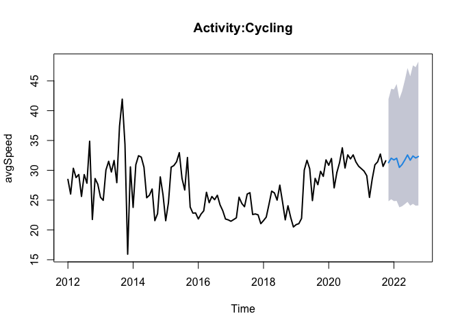

The residuals in ARIMA models tell a story about the performance of our
model and should be taken into consideration when evaluating them. Here
we see residuals that are not much correlated and have reasonably good
behavior regarding the zero-mean and Gaussian-like distribution.

``` r
checkresiduals(prev)
```

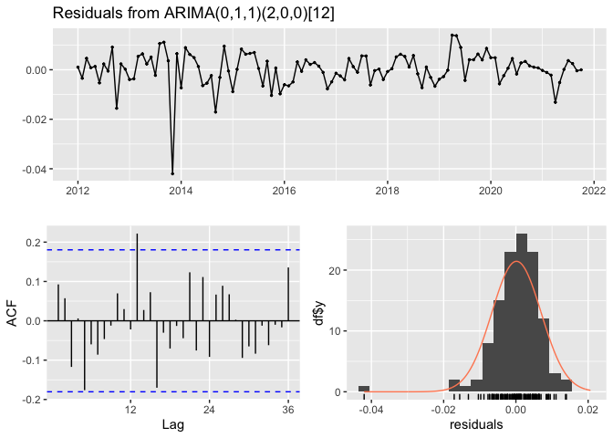

    ## 
    ##  Ljung-Box test
    ## 
    ## data:  Residuals from ARIMA(0,1,1)(2,0,0)[12]
    ## Q* = 28.333, df = 21, p-value = 0.131
    ## 
    ## Model df: 3.   Total lags used: 24


## Predictions using PROPHET:

Prophet is an open source library published by Facebook that is based on
decomposable (trend+seasonality+holidays) models. It provides us with
the ability to make time series predictions with good accuracy using
simple intuitive parameters and has support for including impact of
custom seasonality and holidays.

There is clearly seasonality in the prophet forecast, predicting a
period of lower cycling average speeds during the winter and an
increasing speed towards the European summer.

``` r
library(prophet)
```

``` r
tseries2 <- fortify(series_imp) %>% 
  mutate(ds = as.Date(Index),y = series_imp)

prev2 <- prophet(tseries2)
```

    ## Disabling weekly seasonality. Run prophet with weekly.seasonality=TRUE to override this.

    ## Disabling daily seasonality. Run prophet with daily.seasonality=TRUE to override this.

``` r
future <- make_future_dataframe(prev2, periods=12, freq = "month")

forecast <- predict(prev2, future)
prophet_plot_components(prev2, forecast)
```

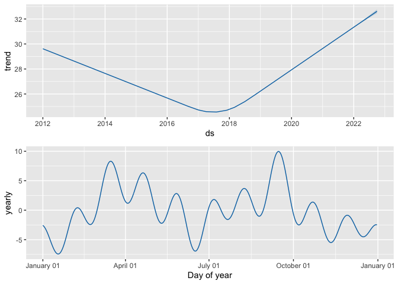

``` r
plot(prev2, forecast, main='avgSpeed forecast for Cycling activity',xlab="Time",ylab="avgSpeed (km/h)")
```

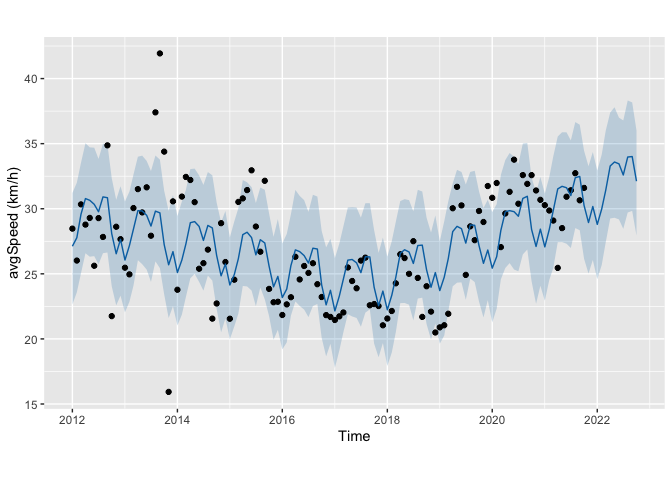

## Predictions for the Average Heart rate *AvgHr* in *Cycling*:

We are going to run everything again, for the ***AvgHr*** and changing
the monthly aggregation to **median**, which seems more reasonable.

``` r
dat_cycling_avgHr <- dat_cycling %>%
  select(date,avgHr) %>%
  na.omit() %>% 
  complete(date = seq.Date(min(as.Date(date)), max(as.Date(date)), by="month"))

xts2 <- xts(dat_cycling_avgHr$avgHr, dat_cycling_avgHr$date)
series <- apply.monthly(xts2,median)
ggplot(dat_cycling_avgHr, aes(date,avgHr)) + geom_point(size=1, color = "darkred")
```

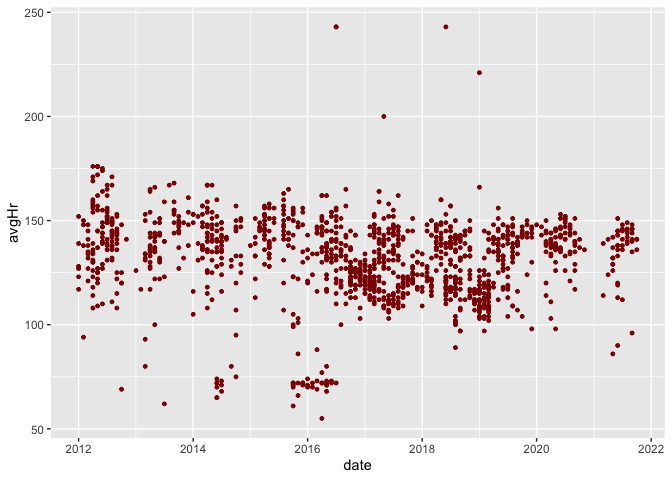

The plot of Average Heart rate shows a change on type of activity also.
From 2017 to 2019-2020 we see more frequent cycling trainings with lower
HRs. This will, for sure, have an impact in our predictions.

``` r
series_imp <- na_kalman(series)
head(series_imp)
```

    ## Warning: timezone of object (UTC) is different than current timezone ().

    ##             [,1]
    ## 2012-01-01 127.5
    ## 2012-02-01 143.0
    ## 2012-03-01 135.0
    ## 2012-04-01 136.0
    ## 2012-05-01 145.0
    ## 2012-06-01 144.0

``` r
ggplot_na_imputations(series, series_imp)
```

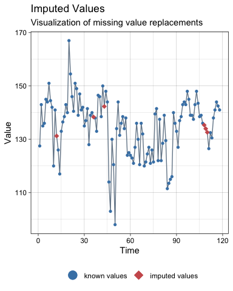

``` r
par(mfrow=c(3,1))
Acf(series_imp)
Pacf(series_imp)
Acf(diff(series_imp))
```

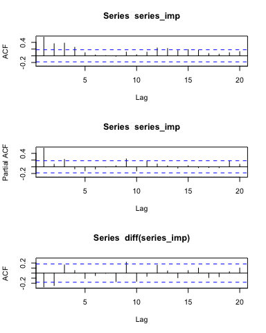

``` r
Box.test(series_imp, lag=10, type="Ljung-Box")
```

    ## 
    ##  Box-Ljung test
    ## 
    ## data:  series_imp
    ## X-squared = 81.771, df = 10, p-value = 2.256e-13

``` r
kpss.test(series_imp)
```

    ## Warning in kpss.test(series_imp): p-value greater than printed p-value

    ## 
    ##  KPSS Test for Level Stationarity
    ## 
    ## data:  series_imp
    ## KPSS Level = 0.32064, Truncation lag parameter = 4, p-value = 0.1

Here we have doubts about the stationarity of the series (avgHr). Maybe
a BoxCox transformation can reduce the discrepancy in variance.

``` r
tseries<- ts(series_imp, frequency=12, start=c(2012,1))
Lambda <- BoxCox.lambda(tseries); 
prev <- auto.arima(tseries, lambda=Lambda) 
fcast <- forecast(prev, h=12, level=c(90)); fcast
```

    ##          Point Forecast    Lo 90    Hi 90
    ## Nov 2021       138.2347 123.7482 151.3410
    ## Dec 2021       136.8734 120.0031 151.8815
    ## Jan 2022       135.9352 118.2962 151.5349
    ## Feb 2022       135.3050 117.3807 151.1182
    ## Mar 2022       133.9951 115.8100 149.9915
    ## Apr 2022       134.9548 116.9015 150.8632
    ## May 2022       134.5267 116.4017 150.4845
    ## Jun 2022       135.8792 117.9605 151.6960
    ## Jul 2022       136.4326 118.5971 152.1923
    ## Aug 2022       137.0047 119.2546 152.7054
    ## Sep 2022       136.7063 118.9116 152.4378
    ## Oct 2022       136.4129 118.5742 152.1747

``` r
par(mfrow=c(1,1))
plot(fcast, col=1, main="Activity:Cycling", type="l", lwd="2", ylab= "avgHr", xlab="Time")
```

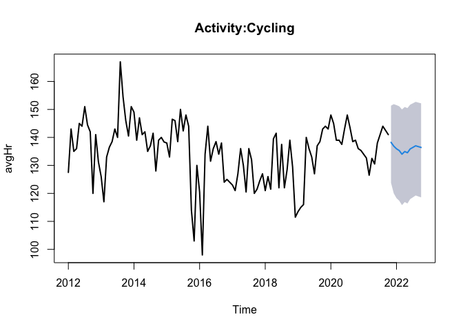

``` r
checkresiduals(prev)
```

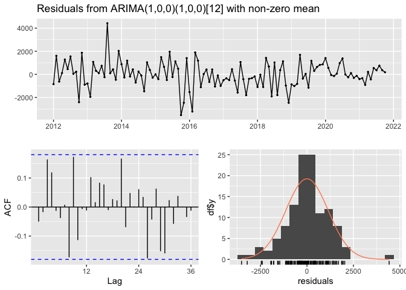

    ## 
    ##  Ljung-Box test
    ## 
    ## data:  Residuals from ARIMA(1,0,0)(1,0,0)[12] with non-zero mean
    ## Q* = 24.189, df = 21, p-value = 0.284
    ## 
    ## Model df: 3.   Total lags used: 24

The residuals are not correlated and have reasonably good behavior
regarding the zero-mean and Gaussian-like distribution, with good
Ljung-Box test for stationarity.

The prophet below also predicts a period (winter) with less intense
(lower average heart rate) cycling, which changes in the beginning of
the year, getting more intense towards the European summer.

``` r
tseries2 <- fortify(series_imp) %>% 
  mutate(ds = as.Date(Index),y = series_imp)

prev2 <- prophet(tseries2)
```

    ## Disabling weekly seasonality. Run prophet with weekly.seasonality=TRUE to override this.

    ## Disabling daily seasonality. Run prophet with daily.seasonality=TRUE to override this.

``` r
future <- make_future_dataframe(prev2, periods=12, freq="month") 

forecast <- predict(prev2, future)
plot(prev2, forecast, main='avgHr forecast for Cycling activity',xlab="Time",ylab="avgHr")
```

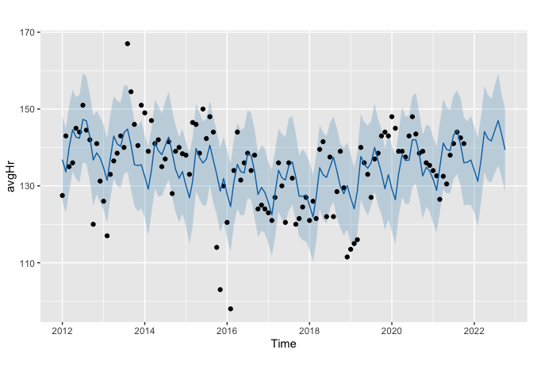

``` r
prophet_plot_components(prev2, forecast)
```


